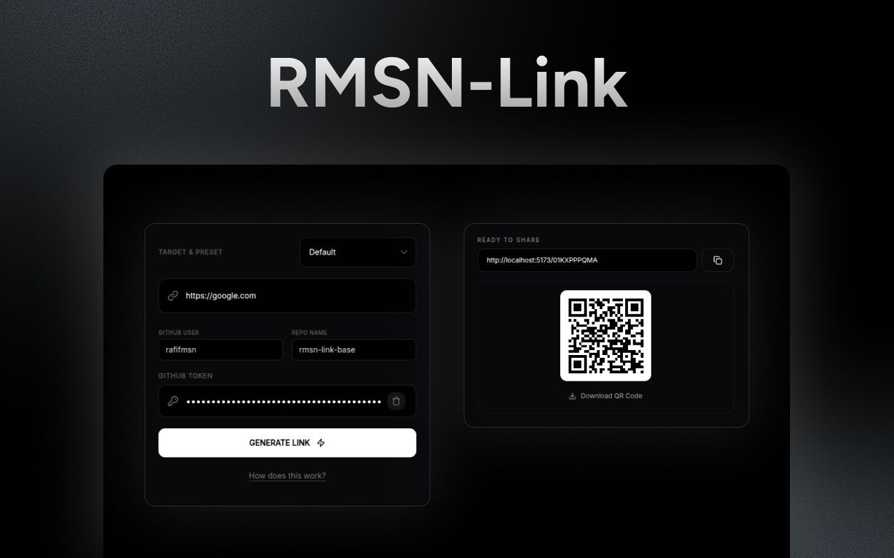

# RMSN-Link




A high-performance, serverless, and completely free link shortener built using Astro 6, Tailwind CSS v4, and GitHub repo as the database. This project is designed for users who want 100% control over their data with zero hosting costs.

## How It Works

This project leverages a "Client-to-CDN" pattern:

1. **Creation:** The admin dashboard uses your GitHub Personal Access Token (PAT) to commit a JSON file directly to your chosen repository via the GitHub API.
2. **Storage:** Links are stored as JSON files in a time-structured directory: `data/YYYY/MM/ULID.json`.
3. **Resolution:** The `404.astro` page acts as a "Smart Resolver." It detects the storage location, fetches the raw data from GitHub's CDN, and performs the redirect.

## Resolver Flow

When someone clicks a link, the `404.astro` script executes this logic in order:

1. **Priority 1 (The Hash):** Does the URL have `#u=` and `&r=`? If yes, it fetches from that user/repo immediately. This is the "portable" version that works for any GitHub repo without registration.
2. **Priority 2 (The Prefix):** Is there a "folder" before the ID (like `/r/` or `/dl/`)? If yes, it checks `domains.json` for a matching prefix to find the repo.
3. **Priority 3 (The Default):** Is it just `domain.com/ID`? If yes, it checks `domains.json` for the entry marked `"default": true`.
4. **Fallback:** If all the above fail (or the file doesn't exist on GitHub), the system waits 5 seconds and redirects the user to the home page.

## Privacy, Obfuscation & Security Scope

This project is built on a "Local-First" architecture. Because there is no external database or specialized authentication server, understanding your security boundaries is vital to keeping your environment safe.

### GitHub Token Protection

Your GitHub Personal Access Token (PAT) is the key to your "database." To protect it from casual exposure, we implement a **Symmetric XOR Obfuscation** layer:

- **Static Key Obfuscation:** The script uses an internal `OBS_KEY` constant which serves as the "password" for both the encryption and decryption processes.
- **XOR Operation:** This is a bitwise operation where each character of your token is shifted against a corresponding character in the key. It is computationally inexpensive and perfectly reversible.
- **Base64 Wrapper:** After the XOR shift, the resulting string is wrapped in `btoa()` (Base64). This ensures the scrambled data is stored as a stable ASCII string safe to persist in the browser (we store it encrypted in IndexedDB).
- **Deterministic Flow:** This process is strictly deterministic—the same token always produces the same encrypted string, allowing for seamless retrieval without a backend.

**Logic Flow:**

- **Storage:** `Token` + `Static Key` → `XOR Bitshift` → `Base64 Encode` → `IndexedDB` (encrypted).
- **Retrieval:** `IndexedDB` → `Base64 Decode` → `XOR Bitshift` (with same Key) → `Original Token`.
- **Clearing Saved Token:** To remove a previously saved token from the browser, use the trash icon next to the Token field in the dashboard — this clears the stored token from IndexedDB.

### Security Boundaries

While both the creation dashboard and the resolver engine apply sanitization rules to block persistent Cross-Site Scripting (XSS) and path-traversal inputs, you must understand what this client-side crypto approach actually defends against:

| Threat Vector                                        | Security Layer / Status                   | What It Actually Means                                                                                                                                                                                                                                                                                       |
| ---------------------------------------------------- | ----------------------------------------- | ------------------------------------------------------------------------------------------------------------------------------------------------------------------------------------------------------------------------------------------------------------------------------------------------------------ |
| **External Websites Trying to Steal Data**           | **Protected** (via Browser SOP)           | The browser's Same-Origin Policy (SOP) completely locks down your IndexedDB file. `evil.com` cannot view or query your application's data.                                                                                                                                                                   |
| **Malicious Browser Extensions / Shoulder Surfing**  | **Protected** (via XOR Obfuscation)       | Hides the structural `ghp_` prefix signature from extension scrapers and masks your plain text token if someone looks over your shoulder at your DevTools panel.                                                                                                                                             |
| **Active Cross-Site Scripting (XSS) Data Theft**     | **Fully Neutered** (via Cloudflare CSP)\* | **XOR is obfuscation, not high-grade encryption.** If an attacker gains script execution inside your origin, they can read the local key and decrypt the token. However, because our strict CSP headers are active, **the browser will instantly block them from sending that token to an external server.** |
| **Physical Theft of Device / Unlocked Workstations** | **Not Protected** (OS Dependent)          | If an unauthorized individual accesses your physical machine, they can use browser inspection interfaces to interact with local memory variables.                                                                                                                                                            |

\* _Note: CSP protection relies on deploying the site to a hosting provider that natively respects and processes the custom `_headers` file configuration (such as Cloudflare Pages)._

> [!NOTE]
> **Static Client-Side vs. Server-Side Architecture**
> Because this is a serverless, static project, all logic (including token obfuscation and retrieval) executes inside the browser. While the IndexedDB storage is scoped securely via the browser's Same-Origin Policy, it is not a substitute for a true server-side backend database. For high-security enterprise environments, you should implement a traditional server-side (SSR) backend and utilize a centralized server-side database to avoid exposing or storing tokens client-side.

**Security Tips:**

- **Use Fine-Grained GitHub Tokens:** Do not use full-access developer accounts. Issue a **Fine-Grained Personal Access Token** limited exclusively to the specific repository acting as your link database, granting write/read permissions strictly to its file contents.
- **Guard Dashboard Access:** For true enterprise isolation, secure your dashboard interface behind **Cloudflare Zero Trust** or an equivalent identity provider. This ensures only authorized identities can load the dashboard assets.

## Data Structure

Links are organized to prevent GitHub directory throttling and ensure fast API lookups:

```text
repository-root/
└── data/
    └── 2026/
        └── 02/
            └── 01KGK9DBCY.json

```

**JSON Schema:**

```json
{
  "target": "https://rafifmsn.com/absolute-path",
  "repoUser": "rafifmsn",
  "repoName": "rmsn-link",
  "created": "2026-02-05T08:00:00Z"
}
```

## Setup & Configuration

### Environment Variables & Custom Branding

You can customize the brand name (which displays in page headers, titles, and metadata) and the app URL using environment variables:

- `PUBLIC_BRAND_NAME`: Customize the branding text (defaults to `"Rafif Muchsin"`).
- `PUBLIC_APP_URL`: Configure the canonical app URL (defaults to `"https://s.rafifmsn.com"`).

#### Configuring Locally
Create a `.env` file in the root directory:
```ini
PUBLIC_BRAND_NAME="My Custom Brand"
PUBLIC_APP_URL="https://links.mybrand.com"
PORT=8080
```

#### Configuring in Docker Compose
You can pass these variables as build arguments when building the image:
```bash
docker compose build --build-arg PUBLIC_BRAND_NAME="My Custom Brand" --build-arg PUBLIC_APP_URL="https://links.mybrand.com"
```
Or define them in your shell environment before running:
```bash
PUBLIC_BRAND_NAME="My Custom Brand" docker compose build
```

### Analytics

The layout template in `src/layout/Layout.astro` contains a default analytics tracking script (Umami). If you are deploying your own version of this project, you should either remove this script or replace the `src` and `data-website-id` with your own analytics provider details.

Additionally, make sure to update the Content Security Policy (CSP) header in `public/_headers` to whitelist your analytics provider's domains in the `script-src` and `connect-src` directives if they are hosted externally.

**1. Repository Setup**

- Create a public GitHub repository to hold your link data.
- Configure `public/domains.json` in your Astro project:
  ```json
  [
    {
      "prefix": "",
      "name": "Default",
      "user": "your-username",
      "repo": "your-link-repo",
      "default": true
    },
    {
      "prefix": "dl",
      "name": "Downloads",
      "user": "your-username",
      "repo": "another-repo"
    }
  ]
  ```

**2. Deployment**

#### Static Hosting (Cloudflare Pages, Vercel, Netlify, etc.)

- Connect your repository to your hosting provider.
- Build Settings:
  - Framework: `Astro`
  - Build Command: `npm run build`
  - Output Directory: `dist`

#### Docker Deployment

You can self-host this static build or deploy it using Docker. A multi-stage `Dockerfile` and `docker-compose.yml` are provided.

##### 1. Using Docker Compose
Start the service with:
```bash
docker compose up -d
```
By default, the dashboard and resolver will be served on port `8080` (i.e. `http://localhost:8080`). To override the port, set the `PORT` environment variable:
```bash
PORT=9000 docker compose up -d
```

##### 2. Build and Run Manually
```bash
docker build -t rmsn-link .
docker run -p 8080:80 rmsn-link
```

**3. Usage**

- Open your deployed dashboard.
- Enter your PAT and Destination URL.
- The "Smart Match" logic automatically detects if you are using a registered repo and generates a clean URL. Otherwise, it generates a portable Hash-based URL.
